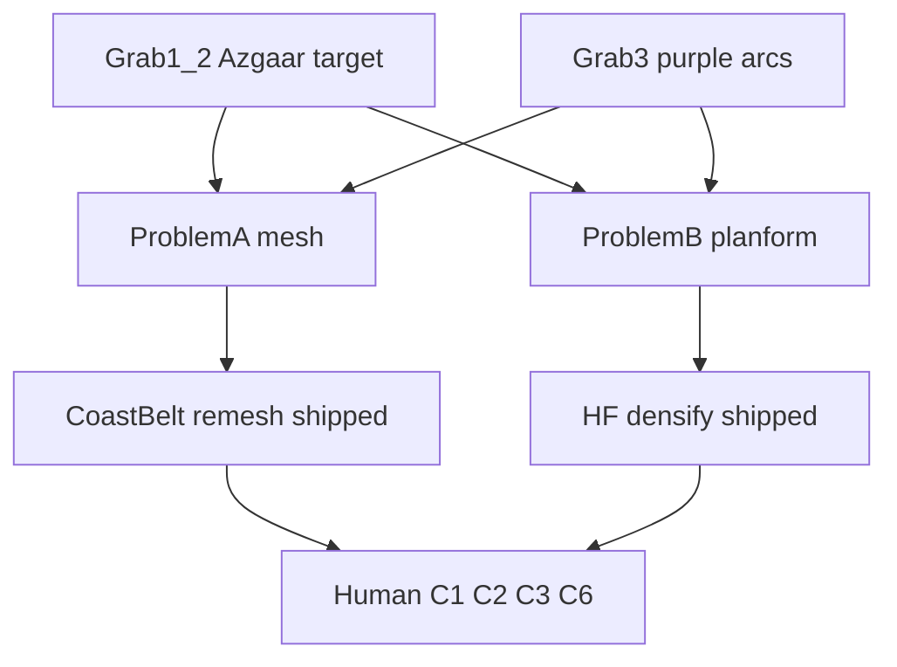

# IH_WB_Heightmap Handoff — 2026-08-11

## 1. Header

- **Date:** 2026-08-11
- **Project:** `D:\Projects\UE58Projects\IH_WB_Heightmap\IH_WB_Heightmap.uproject` (UE 5.8)
- **Repo:** `https://github.com/Robster6060/IH_WB_Heightmap.git`
- **Branch:** `main` (local; push only when asked)
- **Safe revert juncture:** `juncture/ih-wb-waterline-clamp-2026-08-10`
- **Juncture SHA (tag tip):** `389d4d25f2d53cdf17dbb6227cc39b34bcb92d82`
- **Prior handoff:** `IH_WB_Heightmap_Handoff_2026-08-10.md` (historical)
- **Do No Harm:** if C1 flood-fill chords return → set `bContourGoldCoastBeltEnabled=false` immediately (`bContourGoldRimStripEnabled` stays **false**)
- **Purpose:** Close Azgaar goal vs Grab 3 gap — dual Problems A (Minecraft IslandMesh) + B (bulbous planform). **Not too far invested.** Stay **40k+513**.

## 2. Grab 1–2 vs Grab 3 diagnosis

| | Grab 1–2 (Azgaar target) | Grab 3 (our pipeline fail) |
| --- | --- | --- |
| Perimeter | Nested ratio-free compound inlets dominate | ~80% steady invariable monotonous rounded arcs (purple strokes) |
| Structure | Parent bay → daughter → granddaughter nesting | Gold-nest troughs exist but **cluster** at few mouths |
| Barrier islets | Frequent along complex shore / nested bays | Sparse (few tethered scalene + mouth pockets) |
| Edge quality | Organic irregular silhouette | IslandMesh MS lattice stairs + soft radial mass |

**Why the pipeline differs (architecture):**

1. Macro elliptical blobs establish soft radial mass before carve.
2. Beach wedges + beach-class arcs skip purple densifier → long smooth purple expanses.
3. Gold-nest troughs create rich nested mouths **locally**; they do not retexture the whole circumference.
4. Purple densifier was shallow radial stubs (now deepened in shipped densify — eye open).
5. Barrier islets capped low vs Grab 1 archipelago density (budget raised — eye open).
6. Post-carve Smooth + ContourGold Chaikin further round micro-jag.
7. IslandMesh = N×N marching-squares tris — Chaikin/hardSnap do not change edge connectivity (Problem A).

**Verdict:** Not too far invested. No full Azgaar FMG cell-graph rewrite required. Operator counts ≠ perimeter coverage — checklist can mark nest carve “done” while eye still fails Grab 1–2.

## 3. Dual failure (do not conflate)

| Problem | Symptom | Fix | Status |
| --- | --- | --- | --- |
| **A** Minecraft MS stairs | IslandMesh lattice silhouette | ContourGold coastal-belt remesh into IslandMesh (no Cheb omit) | **Code shipped**; C2 eye open |
| **B** Bulbous planform | ~80% purple-stroke arcs vs Grab 1–2 | HF densifier/carve coverage + islet budget + less Chaikin | **Code shipped**; C6 eye open |

Remesh alone cannot invent Grab 1–2 nesting. Densify alone cannot fix MS edge connectivity.



## 4. Signed off this arc

| Item | Status |
| --- | --- |
| Contours/WWF + Features + minimap chords/islets | **PASS** (prior) |
| IslandMesh fly sawtooth / open Z-omit rim | **PASS** — waterline clamp |
| DryGold apron / SandApron | **Method FAIL** — do not revive |
| Gate A Grade + TheaterYellow | **PASS** hold (confirm C3) |
| Inlet flood-fill chords R1/R2 | **PASS** signed (must hold under coast belt = C1) |
| ContourGold rim v2 silhouette | **FAIL (method)** — flag **OFF** |

**Clamp checklist:** `IH_WB_Weld_WWF_Unitary_PIE_Checklist_2026-08-09.md` (**PASS**)  
**Inventory:** `IH_WB_Session_SignOff_Deferred_TODO_2026-08-08.md`  
**Beach next:** `IH_WB_BeachTerraform_NextPass_2026-08-07.md`  
**Acceptance:** `ACCEPTANCE_GATES.md`  
**PIE checklist:** `IH_WB_CoveBeach_ContourGold_PIE_Checklist_2026-08-10.md` (**C1/C2/C3/C6**)

## 5. Shipped this arc (code; human eye open)

| Item | Detail |
| --- | --- |
| Rim v2 | `bContourGoldRimStripEnabled=false` — exit Cheb-omit half-state |
| Coast belt remesh v1 | `bContourGoldCoastBeltEnabled=true` — ContourGold↔inland offset; max-edge + wet mid reject; log `coastBeltTris=` / `coastBeltRejected=` |
| Coast belt authority polish | max-edge **4.0×**; inland **1.5×**; ring verts **720** (cut Minecraft stairs reject) |
| Planform densify (B) | More trunks/sides; deeper purple stubs; more micro-nests; more barrier islets; narrower beach-skip; Smooth center weight 3.0 |
| Planform densify iterate (B2) | 1× narrow beach wedge; Beach class −0.38; deeper knife stubs (no flare); CoveSlots/MicroSlots↑; islets↑; Smooth 4.0; secondary Chaikin×1 |
| Fjord polish (Grab1–4) | Long densifier stubs → mid-spine daughters; short → half-moon coves; residual purple nick outside Gate-2 |
| Features yellow-on-bluff | Slope ~tan(6°) + side samples → Bluff reporter |
| ContourGold Chaikin | Main **×1** @0.22; secondary **×1** (B2 less over-round) |
| Bluff long-span | Longer λ + stronger DeltaScale on sheer faces |
| Editor build | `IH_WB_HeightmapEditor` Win64 Development **Succeeded** 2026-08-11 (Grab1–4 polish) |

**Human Grab A–E not signed yet** — re-PIE after polish; paste logs (checklist Grab A–E).

## 6. Human gates

| Gate | Status |
| --- | --- |
| C1 Flood-fill chords under coast belt | **PASS** (Grab1–4) — must hold after belt authority polish |
| C2 Minecraft IslandMesh silhouette (A) | **Open** — belt authority polish eye (Grab A/B) |
| C3 Grade / TheaterYellow | Grade **PASS** hold; TheaterYellow pad eye (Grab C) |
| C6 Planform nested density (B) vs Grab 1–2 | **Closer** (~15% purple); daughter/half-moon eye (Grab D/E) |
| C5 Bluff long-span | After A progress |
| Samples-1025 / Fibonacci / full Azgaar rewrite | **Deferred** until A+B eye PASS + ask |

## 7. Next-chat priority + todo list

1. **Human Grab A–E** — see `IH_WB_CoveBeach_ContourGold_PIE_Checklist_2026-08-10.md`; chords FAIL → `bContourGoldCoastBeltEnabled=false`
2. Keep deferred: samples-1025, Fibonacci, full Azgaar rewrite, rim v2, SandApron

**Log paste:**

```text
coastBelt enabled=? coastBeltTris=? coastBeltRejected=? | rimStrip enabled=0 | hardSnap=2 | waterlineClamp=1 | mixedClampTris=
```

## 8. Deferred (do not casually unlock)

- Samples **1025** / 1-sector=1-acre densify / production Fibonacci
- Full Azgaar polyline/cell-frontier rewrite
- Sea Roots frustum / Ultimate Sky
- Re-enable rim v2 (`bContourGoldRimStripEnabled`)
- SandApron / dryGold revival

## 9. Do not

- Revive SandApron / dryGold
- Patch chords forward if C1 FAIL — disable coast belt first
- Unlock samples-1025 / Fibonacci without ask
- Flatten Bluff / reopen Grade for Minecraft-only debt
- Re-enable rimStrip Cheb-omit half-state
- Start full Azgaar rewrite for Minecraft-only or purple-arc debt without A+B eye PASS + ask

## 10. Code pointers

- Coast belt: `Source/IH_WB_Heightmap/InvisibleHand/IH_WB_IslandActor.cpp` — `AppendContourGoldCoastBelt`; log `coastBeltTris=`
- Spec: `IHInvisibleHandDesignSpec.h` — belt max-edge **4.0×**, inland **1.5×**, verts **720**; rim v2 OFF; belt ON
- Do No Harm kill switch: `bContourGoldCoastBeltEnabled=false`
- Planform densify + fjord polish: `IHHeightfieldCoastGenerator.cpp` densifier stub/micro loop
- ContourGold Chaikin: Main ×1 / secondary ×1 @0.22 in `BuildMeshesFromHeightfield`
- Clamp / hardSnap=2: unchanged; waterlineClamp owns mixed tris

## 11. Safe revert juncture

**Tag:** `juncture/ih-wb-waterline-clamp-2026-08-10`  
**Tag tip SHA:** `389d4d25f2d53cdf17dbb6227cc39b34bcb92d82`

```text
git fetch --tags
git switch --detach juncture/ih-wb-waterline-clamp-2026-08-10
```

## 12. Opening script (paste into new agent chat)

```text
You are continuing IH_WB_Heightmap (UE 5.8) at:
D:\Projects\UE58Projects\IH_WB_Heightmap\IH_WB_Heightmap.uproject

Read first (in order):
1. Content/InvisibleHand/IH_WB_Heightmap_Handoff_2026-08-11.md
2. Content/InvisibleHand/IH_WB_CoveBeach_ContourGold_PIE_Checklist_2026-08-10.md
3. Content/InvisibleHand/ACCEPTANCE_GATES.md
4. Content/InvisibleHand/IH_WB_Session_SignOff_Deferred_TODO_2026-08-08.md

Mission: Azgaar goal vs Grab 3 — not too far invested.
- Grab 1–2 target: irregular coast with nested ratio-free compound inlets + barrier islets (no broad monotonous arcs).
- Grab 3 fail: ~80% steady uniform rounded coastline (purple strokes).
- Dual failure: (A) Minecraft MS IslandMesh topology → coast belt remesh shipped; (B) bulbous HF planform → densify shipped.
- Verdict: NOT too far invested; no full Azgaar rewrite; stay 40k+513.

Start: Human re-PIE C1/C2/C3 (then C6 planform). Paste logs:
coastBelt enabled=? coastBeltTris=? coastBeltRejected=? | rimStrip enabled=0 | hardSnap=2 | waterlineClamp=1 | mixedClampTris=

Do No Harm: C1 chords → set bContourGoldCoastBeltEnabled=false immediately (rim v2 stays false).
Do not unlock 1025 / Fibonacci / SandApron / rim v2 / full Azgaar rewrite without ask.
Do not reopen Grade for Minecraft-only debt.
If C1 PASS + C6 still ~80% purple arcs → iterate planform densify coverage only (not 1025).
```
